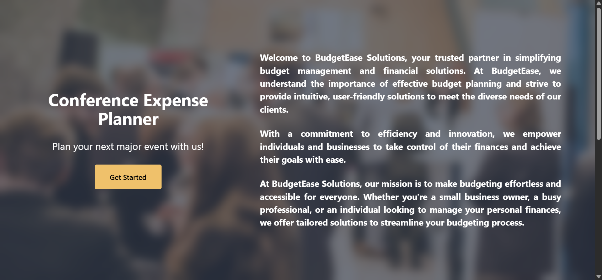
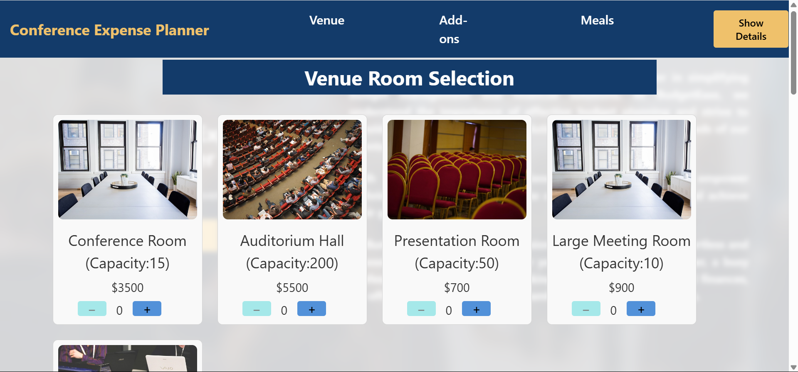
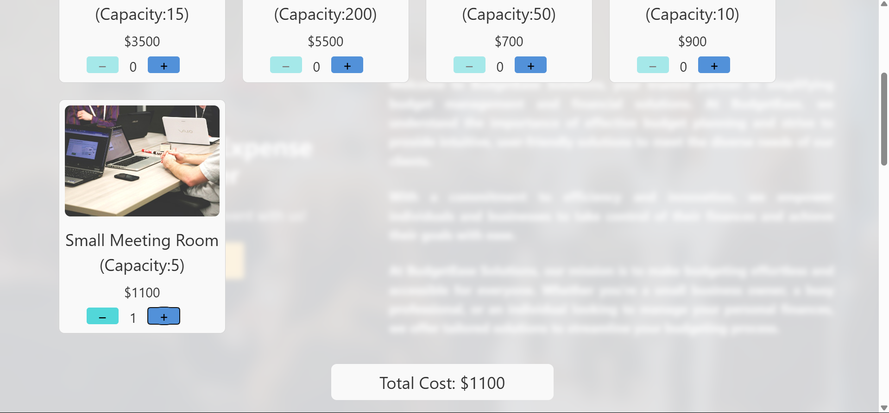
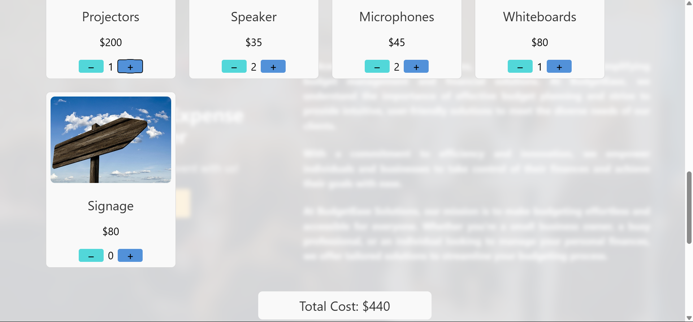
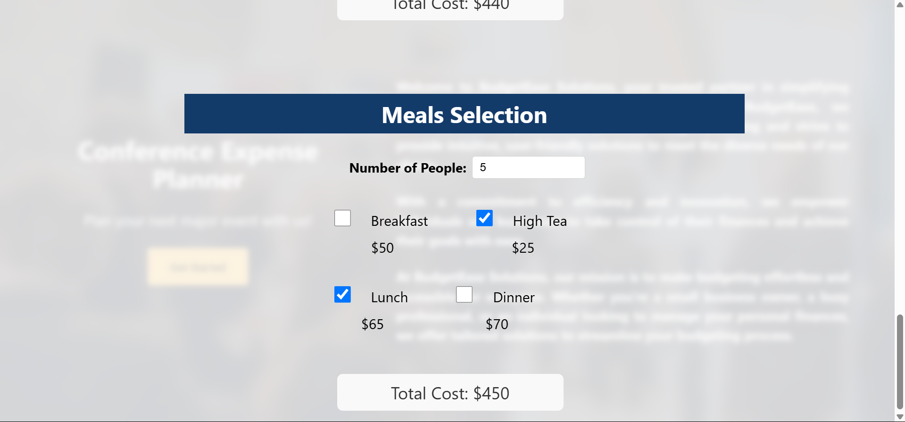
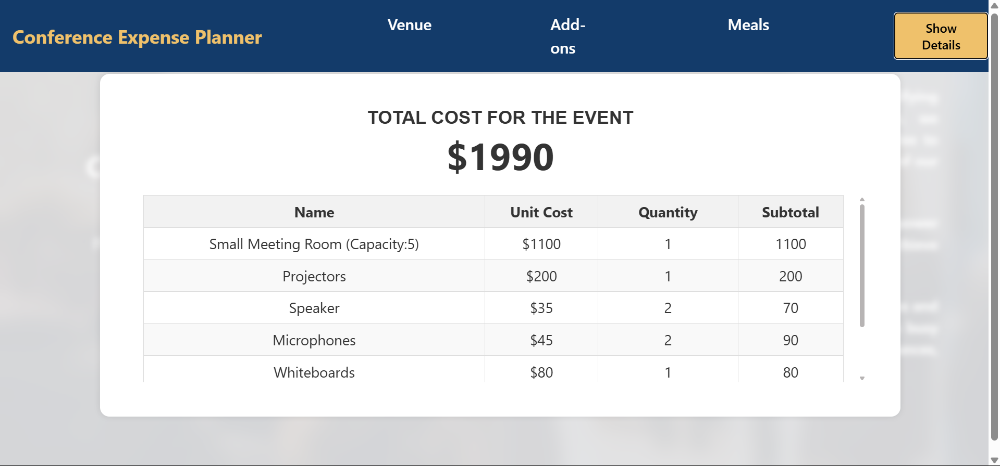
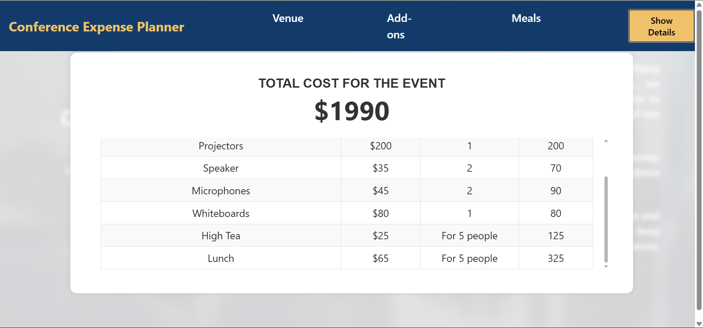

# Conference Expense Planner

Alejandre manages a venue for business conferences. Her parent company, "BudgetEase" wants to hire you to develop a website so BudgetEase customers can price their conference events easily.

The application's requirements include allowing users to select and price the rooms in the conference center, add-on selections, like microphones and projectors, and meals for a given number of guests.

